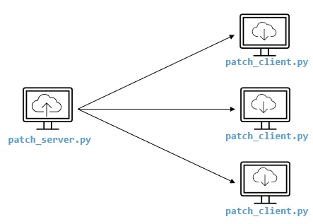
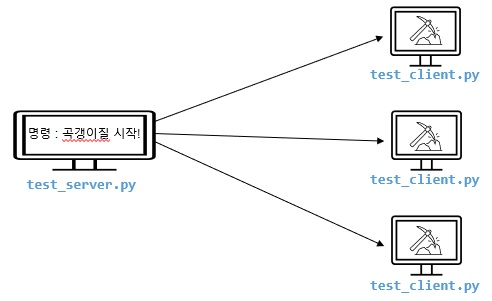

# 테스트 자동화 파일 목록 / 설명

## patch_server.py, patch_client.py

    자동화 테스트 클라이언트 업데이트 시 자동으로 클라이언트 파일을 업데이트 시켜주는 클라이언트 파일
        : socket, requests, subprocess
        : 소켓, 리퀴스츠, 서브프로세스 : 소켓통신과 업데이트 소스를 전달해 주고, 해당 파일 저장 후 실행해 주는 프레임워크를 사용하였습니다.

    소켓통신으로 메시지를 받으면, 업데이트해야하는 테스트클라이언트를 업데이트 해주는 기능

    테스트 pc에는 해당 패치클라이언트가 항상 켜있어서, 서버에서 메시지를 받으면 기능이 작동해야 합니다.

# test_server.py, test_client.py

    게임 실행이 가능한 클라이언트 파일
    여러개의 브라우저를 띄우거나, 하나의 브라우저를 띄워서 게임을 실행할 수 있게 만들었으며, 브라우저별 컨트롤이 가능하도록 만듬.
    페이지 새로고침 부터 html5로 만든 게임의 페이지를 실행하는 기능, 에러 발생 시 스크린샷을 찍는 기능을 구현하였습니다.
    소켓으로 명령어를 보내면, 해당 명령어대로 진행되는 부분이라고 생각하시면 됩니다.
    명령어를 테스트 시나리오로 짜서 보내면, 해당 명령대로 행동하는 테스트를 진행할 수 있습니다.

## tutoral_test.py

    튜토리얼 부분을 자동으로 넘길 수 있는 자동화 파일
    진행이 완료된 시점에서 스크린샷을 찍어 완료한 내용을 확인하는 부분

        ※ 로그부분 및 데이터베이스에서 진행된 부분은 이 코드에 넣지는 않았음.(구현은 가능)

## bingo_game_auto_test.py

제목 : 빙고 게임 자동화 테스트 파일

사용한 프레임 워크 : selenium, pymysql, PIL 사용

: 웹자동화프레임워크, mysql사용 시 필요한 프레임워크, pil 이미지 관련 프레임워크

- 테스트 시나리오
    1.  1일 1회 진행되는 빙고 시스템의 금일에 빙고를 돌렸는지 db를 통해 확인
    2.  진행 되었으면 초기화 진행 (해당 플레이어 db 초기화 update)
    3.  초기화 후 게임 진행, 
    4.  게임 플레이 버튼까지 누른 후 로그 파싱
    5.  로그를 보며 해당 빙고 진행 정도 및 빙고 당첨 카운트 및 골드 확인
    6.  진행 중 멈춤 발생시 로그 기록, 시간 등
    7.  빙고 1턴 진행시 스크린샷을 찍음
    8.  스크린샷 내에 진행 사항 로그를 같이 찍어서 파일로 저장(데이터와 실제 보여지는것과 차이 비교를 위한 것)
    9.  테스트 완료 후 결과 확인(데이터가 다른 부분은 해당 스크린샷을 확인.

빠르게 코드를 작성하느라 공통으로 빼야하는 부분을 정리하지 못하고 작성한 부분이 있습니다.

## redmine_bug_insert.py

    레드마인 버그리스트를 업데이트 해주는 파일
        : 엑로 정리된 버그리스트를 파이썬에서 읽어들여 레드마인에 등록해주는 자동화 프로그램
        : selenium, openpyxl : 자동화 웹플임워크 및 엑셀파일 데이터를 읽어주는 openpyxl을 사용함.

# 

## 개요
- 파일명 : File_control.py

폴더 생성, 파일 생성, 파일 이름 변경, 파일 삭제, 폴더 삭제를 진행하였습니다.

Yolo V5 학습데이터 이용 시 빠르게 파일 처리를 하기 위해 만들어 보았습니다.

OS모듈 사용한 내용이며, 기초적인 내용입니다.

## 설명
    1. 메인 폴더 생성
    2. 메인 폴더 속 폴더 생성(ex: 5개)
    3. 파일 100개 생성(2번 폴더 속)
    4. 생성한 파일 100개의 이름 변경
    5. 생성한 파일 100개 중 50개 삭제
    6. 삭제 전 파일 수 체크, 삭제 후 파일 수 체크 (정말 삭제되었는지 확인)
    7. 파일 다 지우기(테스트 끝)
    8. 폴더 지우기(파일을 다 지운 폴더를 지우기)

위와 같이 한 이유는

학습데이터는 녹화한 동영상에서 프레임별로 jpg로 저장하였고, 해당 jpg에서 모든걸 다 쓰면 많기 때문에, 반을 지운다.

반을 지울때. enumerate로 번호를 매긴 것 중 %2로 True 혹은 False로 선택해서 지운다.

이름을 변경한 이유는 나중에 다 합쳐서 사용하려고 한다.

## 작성자의 말

- 코드를 깔끔하게 정리하지 못하였음.
- 파일 전체로 실행시키지 말것.
- 읽어보고 사용하기.
- 정리 잘하자.!
- 자주 깃허브 올리기!