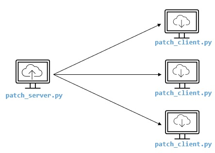
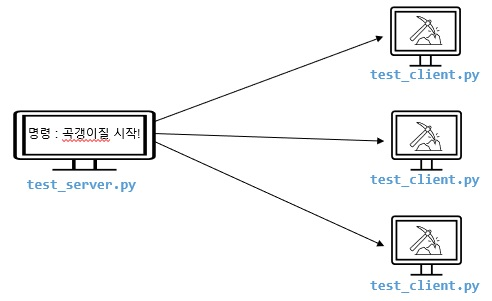

# QA Automation Script (Portfolio)

# 1patch_script
    테스트 스크립트 배포용 (서버-클라 파일)

매번 테스트 스크립트 파일을 파일 서버에서 복사하거나, USB로 복사 혹은 새로운 파일로 다시 작성하는 불편함을 줄이고자 만든 파일입니다.

해당 패치 스크립트를 실행시켜 놓으면, 자동화 테스트 클라이언트를 업데이트 시켜줍니다. 

패치 서버에서 소켓통신으로 업데이트 소스(패치파일)를 전달해 주고, 해당 파일 저장 후 실행하는 구조로 만들었습니다.(자동업데이트 구조라고 생각하면 됩니다.)

- 파일 : patch_server.py, patch_client.py

# 2test_script
    웹 테스트 자동화 (서버, 클라이언트 파일)

게임 실행이 가능한 클라이언트 파일로써, test_server.py에서 테스트 명령을 내리면, 여러개의 브라우저를 띄우거나, 하나의 브라우저를 띄워서 게임을 실행할 수 있게 만들었으며, 브라우저별 컨트롤이 가능하도록 만들었습니다.

Selenium Webdriver를 사용하여 페이지 새로고침부터 html5로 만든 Canvas 페이지를 실행하는 기능, 에러 발생 시 스크린샷을 찍는 기능을 구현하였습니다.

명령어를 테스트 시나리오로 짜서 테스트 서버에서 테스트 클라이언트에게 보내면, 해당 명령대로 행동하는 테스트를 진행할 수 있습니다.

- 파일 : test_server.py, test_client.py

# 3game_test_script
    게임 자동화 테스트 파일

2번과 동일하지만, 다중 클라이언트 실행이 아닌 싱글 클라이언트 테스트 용으로 만든 파일입니다.

빙고게임을 자동으로 진행시키고, 진행 중 나오는 로그에 따라 테스트 결과를 도출하며, 에러사항 발생 시 스크리샷을 찍을 수 있도록하였습니다. 

두번째 파일은 게임 진행에 따라 나오는 로그로 행동들을 판단하고, 다른 기능들을 수행하는 부분을 추가하였습니다.

- 파일 : bingo_game_auto_test.py, log_popup_anaysis.py

# 4mobile_test
    모바일 플랫폼 자동화 테스트 파일

안드로이드 모바일 테스트 스크립트 파일로, apk가 나오면 해당 앱의 기능을 자동으로 수행하는 기능을 가진 자동화 테스트 파일입니다.

단순 기능만 샘플용도로 추가하였으며, 추후 소속되는 회사의 앱이 있는 경우, 자동화 시나리오를 만들어 진행하는 것이 가능하며, api 및 로그 추출도 가능하여, 테스트 진행에 추가하여 진행도 가능하며, 여러대의 실제 디바이스를 연결하여 진행하는 테스트 및 에뮬레이터로도 가능합니다.

- 파일 : appium_mobile_android.py

# 5etc_script
    기타 자동화 파일

파이썬으로 구현한 엑셀로 정리한 버그를 레드마인으로 입력해 주는 스크립트와 웹으로 튜토리얼을 진행하는 스크립트를 구현하였습니다.

- 파일 : redmine_bug_insert.py, tutorial_test.py

# 이외 가능한 영역

* Api test 진행 시 api 문서에 따른 시나리오 구성 및 파이썬을 이용한 자동화 테스트 구현
* IOS, AOS APP의 실제 디바이스 테스트 자동화 구현
* WEB platform 테스트 자동화 구현
* CI 연동하여 테스트 진행 및 리포팅 구현
* ㅉeb framework를 이용하여 웹사이트 구현
* Database를 이용한 검증 및 데이터 품질 확인 python으로 구현 가능
* 데이터 전/후 처리 시 데이터 품질 체크를 코딩으로 확인하는 테스트 구현 가능